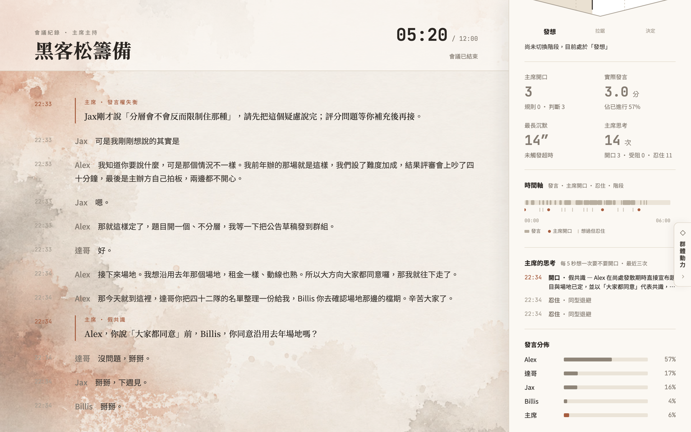

# Ahem

> 咳咳。會議裡那個敢插嘴的 AI 主席。　　[English](README.en.md)

Ahem 是一個**即時主持真人會議**的 AI 主席。它加入 Discord 語音頻道，聽每一個人說話，判斷什麼時候該開口，然後真的開口：打斷講太久的人、點名一直沒說話的人、把離題的討論拉回來、在時限內做出裁決。

它不是會議助理。助理記筆記、追議程、事後摘要；主席管的是**群體過程**，而且有裁決權。



*觀戰畫面，回放 [`examples/synthetic-meeting.events.jsonl`](examples/synthetic-meeting.events.jsonl)——一場虛構的三人會議，與會者與對話皆為合成。*

## 為什麼是主席

會議收斂不了，通常不是因為沒人記筆記，而是**沒有人願意當壞人**：沒人敢打斷資深者、沒人敢說「這跟議題無關」、沒人敢在僵持時拍板。於是大家假裝有共識，散會，下週再開一次。

AI 沒有職涯風險、沒有面子問題。這是它相對於人類主席的結構性優勢——不是「比較會做筆記」。

Ahem 必須敢做四件事：

1. 分配發言權與時間
2. 打斷離題與超時
3. 點名一直沒開口的人，並問到答案
4. 在時限內僵持不下時直接裁決，並說明理由

**它明確不是**：轉錄工具、事後摘要、文字聊天機器人、只給建議的助理。**即時**是硬需求——會後才分析錄音的產品，不是這個專案。

## 它怎麼運作

```
Discord 語音（每人一軌）
   → ElevenLabs Scribe 即時中文逐字稿
   → 兩條判斷路徑
        快路：純規則、零延遲     發言超時／議程超時／有人被冷落／全場沉默
        慢路：LLM，每 5 秒一次   離題／重複／假共識／僵局／事實錯誤
   → 靜默閘門（任一成立就不開口）
        會議收尾中 ／ STT 失效中 ／ 冷卻期內 ／ 話術生成失敗
   → 開口：硬打斷先播提示音再說；軟插入等對方停頓後直接說
   → 觀戰畫面即時更新 → 會後兩份記錄
```

**即時逐字**：說話的同時，觀戰畫面就顯示這段目前講到哪（Scribe 的 partial 每秒更新），停頓後由定稿取代。判斷一律只用定稿，不用草稿。

**慢路是兩次呼叫**：第一次只判斷（三軸分數與類型），通過閘門後第二次才寫出要說的話，而且**必須逐字引用逐字稿裡真的出現過的句子**。生不出合格的話就放棄這次介入，不退回制式句。

**觀戰畫面**給評審與操作者看：主席每一次「開口／受阻／忍住」的判斷與理由、時間軸、發言分佈，以及不出聲的術語補充卡：引言由程式從逐字稿逐字組出；外部說明由 LLM 加網路搜尋產生，必須附來源連結，沒有連結就整段丟棄。

**會後記錄**兩份：會議產出（決議、待辦、未解決事項、立場摘要）與主持記錄（每次介入的時間、類型、理由）。後者是這個專案獨有的——它記錄的是「這場會議是怎麼被引導的」。

## 快速開始

需求：Python 3.11 或 3.12（3.13 需另裝 `audioop-lts`，已列在 requirements）、一個加入你伺服器且有語音權限的 Discord bot、ElevenLabs 與 OpenAI 的 API key。主席預設仍用 ElevenLabs 發言；若要使用 Azure 台灣男聲或女聲，另需 Azure Speech key。

```bash
git clone https://github.com/Chuanyin1202/ahem.git && cd ahem
python -m venv .venv && .venv/bin/pip install -r requirements.txt
cp .env.example .env        # 填入 ELEVENLABS_API_KEY、OPENAI_API_KEY、DISCORD_BOT_TOKEN
```

改用已實聽確認的 Azure 台灣主席聲音：

```dotenv
AHEM_TTS_PROVIDER=azure
AZURE_SPEECH_KEY=<Azure Speech key>
AZURE_SPEECH_REGION=eastasia
AZURE_TTS_GENDER=female
AZURE_TTS_RATE=+12%
AZURE_TTS_MONTHLY_LIMIT=500000
AZURE_TTS_HARD_STOP_PERCENT=95
AZURE_TTS_WARNING_PERCENTS=80,90,95
AZURE_TTS_USAGE_FILE=meetings/azure_tts_usage.json
```

`AZURE_TTS_GENDER=female` 是 1 號小辰女聲，改成 `male` 就是 5 號雲哲男聲。
兩者均使用相同的 `+12%` 語速。如需進階指定其他 Azure 聲線，可另設
`AZURE_TTS_VOICE`，其優先權高於性別預設。

這只替換主席的 TTS；即時逐字稿仍由 ElevenLabs Scribe 處理，所以 `ELEVENLABS_API_KEY` 仍須保留。Azure 口說層會把獨立的 `API` 念成已確認的「誒批哀」，並把「收斂」固定成台灣華語 `ㄕㄡ ㄌㄧㄢˋ`；觀戰畫面、事件檔與會後記錄保留原始文字，不會出現發音用的同音字。

Azure `Free F0` 每月額度由 Azure 端強制；Ahem 另在本機保守記帳。預設於 80%、90%、95% 寫出警告，並在 475,000 字元（免費額度的 95%）硬停，保留 5% 緩衝避免不同計量口徑造成超額。使用量記錄在 `meetings/azure_tts_usage.json`，每個 UTC 月自動歸零。Cost Management 預算只能對費用發通知，不能取代這個字元硬上限。

主持一場會議（先讓與會者進語音頻道，或直接給頻道 ID）：

```bash
PYTHONPATH=src .venv/bin/python -u -m meeting_host.live \
    --topic "黑客松籌備" --duration 30 --say-hello --spectator-port 8765 \
    [--channel <頻道 ID>] [--keyterms 詞1 詞2] [--phase 發散期|呻吟區|收斂期] [--auto-phase suggest|apply] [--style strict|gentle|efficient] [--no-llm]
```

觀戰畫面在 `http://localhost:8765`。`Ctrl-C` 結束會議並寫出記錄到 `meetings/`。

啟動時會印出兩個網址：唯讀的給觀眾，帶 `?k=<權杖>` 的給操作者。`POST /phase`（切換階段）與 `POST /end`（結束會議）要帶 `X-Ahem-Token` header，權杖不對回 403。權杖每次啟動隨機產生，用 `--spectator-token` 或環境變數 `AHEM_SPECTATOR_TOKEN` 可以釘住一組。

> **網路暴露**：觀戰服務綁定 `0.0.0.0`，且**讀取端一律公開**——能連到這個埠的任何人都看得到完整逐字稿。掛在公開網域（反向代理、tunnel）後面時要留意這點：會改變狀態的兩個端點有權杖擋著，逐字稿沒有。真實會議內容不想外流就別對外開，或在前面加一層認證。

不用 Discord 也能看畫面——回放任何一份事件檔：

```bash
PYTHONPATH=src .venv/bin/python -m meeting_host.spectator --replay examples/synthetic-meeting.events.jsonl --port 8765 --speed 8
```

測試：

```bash
.venv/bin/python -m pytest tests/ -q
```

沒有真實會議資料時是 494 passed、23 skipped、2 xfailed：17 個 skip 是需要真實錄音的回歸測試，資料放進 `experiments/holdout/` 後自動啟用（見[資料政策](#資料政策)）；另 6 個需要 `playwright`。

## 做到哪裡

Ahem 已在兩場真實 Discord 會議（14 分鐘與 43 分鐘，皆有人工標註）上主持並量測。完整數字與方法在 [docs/validation-results.md](docs/validation-results.md)；結論：

| 面向 | 狀態 |
|---|---|
| 話術品質 | 已解。拆成兩次呼叫後，34 個評分點中 32 個逐字引用逐字稿（拆之前 2 個） |
| 判斷穩定度 | **主要未解問題**。同一批評分點重跑 5 輪，主席開口次數在 1–5 次之間；人工標註「該開口」的三處，5 輪中有 3 輪一處都沒命中。多數決投票已量測，改善有限；三個判準變體（粗尺度、明確判準、兩段式）也沒有一個能同時在兩場改善——把靈敏度調高，誤報就等比例升 |
| 雜務誤判 | 已修。調設備、找檔案曾被判為離題（5/5 輪），修正後 0/5，且未削弱對真正離題的偵測 |
| 介入類型覆蓋 | 六型中「假共識」「事實錯誤」從未在真實會議觸發 |
| STT 失效偵測 | 已實作，僅離線驗證 |
| 階段自動判斷 | 第一版，建議模式；兩場全程發散的錄音上（36 筆讀數）0 次誤切；判準已排除「針對主席的衝突」 |

**尚未完成**：

- **群體過程階段的自動判斷**（發散／呻吟區／收斂，依 Sam Kaner 的 Diamond 模型）——這是產品定位的基礎。已有第一版偵測器（`--auto-phase suggest`：每 60 秒判一次、連續兩次一致才建議、單人或無人說話時不判），預設只建議、由人在觀戰畫面確認；`apply` 才自動套用。**只做過反面驗證**（全程發散的錄音上不亂切），正面驗證要等一場真的走完三階段的會議。
- 主持風格檔位已有第一版（`--style`，三組既有快路門檻的組合），**未調校**：哪組適合哪種會議要靠真實會議實測。

**已定的設計決定**：一個主席、只做中文、不做人格設定、不做 avatar、不做本地備援（預設雲端服務可用）。理由見 [docs/product-definition.md](docs/product-definition.md) 與 [docs/development-plan.md](docs/development-plan.md)。

## 資料政策

真實會議的原始逐字稿與量測產物**不在這個 repo**。文件中引用的少量對話片段與參與者名字，已取得當事人同意。

**資料流向**：會議音訊送往 ElevenLabs 做即時轉錄與語音合成；逐字稿片段送往 OpenAI 做判斷與話術生成，術語查證另經 OpenAI 的網路搜尋。所有紀錄只寫在本機 `meetings/`，保留與刪除由執行者決定。使用前請告知與會者並取得同意。

要驗證 Ahem 在你自己的會議上的表現：主持一場會議得到 `meetings/*.events.jsonl`，放進 `experiments/holdout/<案例>/`，依 [experiments/holdout/README.md](experiments/holdout/README.md) 標註「該開口」與「不該開口」的時段，然後：

```bash
PYTHONPATH=src .venv/bin/python experiments/rescore_slow_path.py experiments/holdout/<案例>/meeting.events.jsonl \
    --labels experiments/holdout/<案例>/labels.json --rounds 5
```

`--rounds 5` 不是選配：單次結果只是一個抽樣，這個專案的所有穩定度結論都來自多輪重跑。

## 專案結構

```
src/meeting_host/
  live.py             會議主迴圈：接線、兩條判斷路徑、閘門、事件、優雅關閉
  discord_source.py   Discord 每人一軌收音（唯一接入的音源）   stt.py   ElevenLabs Scribe 串流池
  fast_path.py        快路四規則                    slow_path.py  慢路：判斷與話術兩次呼叫
  phrasing.py         快路話術庫                    hearing.py    STT 失效偵測
  phase.py            階段自動判斷（LLM 讀數＋遲滯，預設只建議）
  style.py            主持風格檔位（快路門檻的三組預設，未調校）
  speaker.py          提示音、TTS、Chair 狀態機      glossary.py   術語補充卡
  events.py           事件 schema（各模組的接縫）    minutes.py    會後兩份記錄
  spectator.py        觀戰畫面與回放伺服器           state.py      會議狀態
examples/
  synthetic-meeting.events.jsonl         虛構會議的事件檔，供回放與看格式
  synthetic-phases.events.jsonl          虛構的三階段會議，含階段建議與切換事件
experiments/
  rescore_slow_path.py / score_run.py    重評與窗口計分
  holdout/                               自備會議資料（不進版控）
docs/
  product-definition.md    定位：為什麼是主席，與 Teams Facilitator 的差別
  interruption-design.md   插話機制：評分準則、階段感知、提示音策略
  tech-architecture.md     技術架構與選型
  development-plan.md      開發方案與完成狀態
  demo-runbook.md          現場流程：會前檢查、啟動、出事處理、結束
  validation-results.md    驗證摘要（現況一覽與各輪結論）
  validation-log.md        完整工程紀錄，按驗證輪次累積
  results.json             機器可讀的實測數字
  evaluation.md            評估方法
  prior-art.md             相關研究與開源盤點
  specs/                   三份設計規格
  design/                  觀戰畫面設計稿與設計原則（design/README.md）
```

## 貢獻與回報

歡迎 issue 與 pull request，流程見 [CONTRIBUTING.md](CONTRIBUTING.md)；安全問題請依 [SECURITY.md](SECURITY.md) 私下回報。

## 關於

為 FUTUREMODE BUILDMODE GEN-AI HACKATHON 2026（台北，9 月 4–6 日）開發。

授權：[MIT](LICENSE)。
