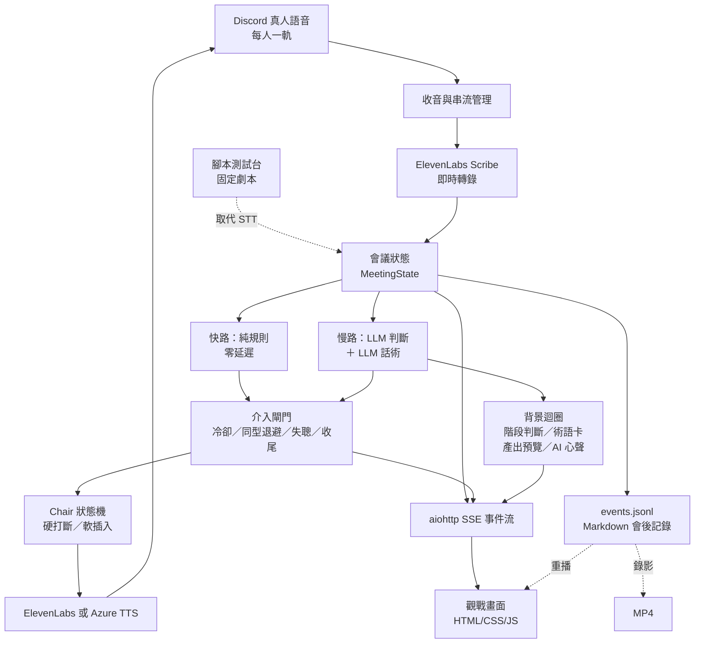

# Ahem — 會議裡敢開口的 AI 主席

> 咳咳。它不做記錄，它做主持：分配發言、拉回離題、在時間內推進決策。

[](#5-測試)
[](LICENSE)

- 主專案：[Chuanyin1202/ahem](https://github.com/Chuanyin1202/ahem)
- 英文版：[README.en.md](README.en.md)
- 完整驗證紀錄（含失敗與更正）：[docs/validation-log.md](docs/validation-log.md)

---

## 問題與目標

團隊會議常見的失敗不是「沒有記錄」，是**沒有人管流程**：發言時間嚴重不均、話題滑走沒人拉回、兩個人卡在同一個爭點繞圈、時間到了還沒有結論。逐字稿工具與會後摘要解決不了這些——它們都是事後的，而**這些問題只有在會議進行中處理才有意義**。

Ahem 的目標使用者是**用 Discord 開會的小型專案團隊**。它以「主席」而不是「記錄助理」的身分參與真人語音會議：即時聽、判斷此刻該不該開口、決定用硬打斷還是等停頓、然後**真的用語音講出來**。

> **不宣稱的事**：我們沒有量到「效率提升 X%」這種數字，也不打算宣稱。目前有的是介入時機的量測與失敗案例紀錄，全部公開在 [docs/validation-results.md](docs/validation-results.md)。

---

## 核心功能

- **即時聆聽與逐字稿**：Discord 每人獨立音軌接 ElevenLabs Scribe，尾段延遲實測 0.34 秒；畫面同步顯示辨識中的文字與定稿。
- **雙路徑主持決策**
  - **快路（規則、零延遲）**：發言超時、議程超時、有人被冷落、全場沉默
  - **慢路（LLM，每 5 秒一次）**：離題、重複、假共識、僵局、事實錯誤、發言權失衡
  - 慢路拆成**兩次呼叫**：先判斷、通過閘門才產生話術——同一次呼叫做這兩件事時，話術指令會回頭污染判斷（34 個真實評分點實測）。
- **可聽見的介入**：硬打斷先播提示音再說話；軟插入等對方停頓，等不到 15 秒才升級。有冷卻期、同型退避、失聰偵測與收尾閘門——**主席不該說話的時候，它閉嘴**。
- **即時觀戰畫面**：完整逐字稿、主席每 5 秒的判斷（開口／受阻／**忍住**）、發言分布、階段時間軸、會議產出即時預覽、AI 對會議與每位與會者的評語。參與者與操作者權杖分開，預設私密。
- **會後兩份記錄**：會議產出（決議／待辦／未解決事項／立場摘要）與**主持記錄**（每次介入的時間、類型、理由）。後者是這個專案獨有的——它記錄的是「這場會議是怎麼被引導的」。
- **腳本測試台**：與會者全是固定劇本、只有主席是真的。不接 Discord、不接 STT，可無人值守跑完整套場景並對期望窗口計分——湊不到人也能迭代主席的判斷品質。
- **會議錄影**：任何一場開過的會議（真實或腳本）都能事後重播成 MP4。

---

## 系統架構



- **前端**：單一 HTML 頁面靠 SSE 更新；操作者可切階段、結束會議。沒有前端框架。
- **後端**：Python 3.13／asyncio 管音訊、事件、判斷與發言；aiohttp 提供 HTTP 與 SSE。
- **模型**：ElevenLabs 負責 STT 與預設 TTS；OpenAI 負責所有語意判斷；Azure Speech 是主席 TTS 的**選用**替代（台灣華語男女聲），不取代 Scribe。
- **資料**：沒有資料庫。會議狀態在記憶體，產出是本機 `events.jsonl` 與 Markdown。
- **事件流是單一真相**：畫面、會後記錄、重播、錄影、離線計分全部讀同一份 `events.jsonl`。

---

## 使用技術

| 類型 | 技術／服務 | 用途 |
| --- | --- | --- |
| AI 模型 | ElevenLabs `scribe_v2_realtime` | 即時中文語音轉文字（尾段延遲實測 0.34 秒） |
| AI 模型 | OpenAI `gpt-5.6-luna`（`reasoning_effort=none`） | 慢路判斷、話術生成、階段判斷、術語抽取、會議產出、AI 心聲 |
| AI 模型 | ElevenLabs `eleven_v3_conversational` | 主席 TTS（串流，首位元組中位 0.15–0.23 秒） |
| AI 模型 | Azure Speech 台灣華語（小辰／雲哲） | **選用**的主席聲音，需自備 Azure Speech 資源 |
| 前端 | HTML／CSS／JavaScript、Server-Sent Events | 即時逐字稿、主席三態、發言分布、階段操作 |
| 後端 | Python 3.13、asyncio、aiohttp、websockets | 非同步管線、HTTP／SSE |
| 音訊 | discord.py、discord-ext-voice_recv、PyNaCl、NumPy、audioop | Discord 每人一軌收音／發聲、重採樣與切幀 |
| 中文處理 | OpenCC（`s2twp`） | Scribe 輸出為簡體，統一轉台灣正體 |
| 資料 | JSONL、Markdown | 事件流與會後記錄；**不需要資料庫** |
| 測試與工具 | pytest、Playwright、ffmpeg | 625 項回歸測試、瀏覽器驗證、會議錄影 |
| Sponsor 技術 | **ElevenLabs**（實際使用：Scribe STT ＋ 串流 TTS） | 【待補】正式 Sponsor 資格與賽道認定依主辦規則確認 |

---

## 安裝與執行

以 macOS／Linux、Python 3.13 為例。若系統回報找不到 PortAudio，需先安裝該系統音訊函式庫。

```bash
git clone https://github.com/Chuanyin1202/ahem.git
cd ahem
python3.13 -m venv .venv
.venv/bin/python -m pip install -r requirements.txt
```

### 1. 不需要任何 API Key：重播一場合成會議

```bash
PYTHONPATH=src .venv/bin/python -m meeting_host.spectator \
  --replay examples/synthetic-meeting.events.jsonl --port 8765 --speed 8
```

用終端印出的網址開啟觀戰畫面。**這是合成事件重播，不是現場辨識與語音生成**——不要把重播效果當成真實服務整合已驗證。

### 2. 腳本測試台：與會者是劇本，主席是真的

需要 `OPENAI_API_KEY`（判斷與話術），不需要 Discord、不需要 STT、不需要音訊裝置：

```bash
cp .env.example .env      # 填入 OPENAI_API_KEY
PYTHONPATH=src .venv/bin/python -m meeting_host.live \
  --script examples/scripts/demo.json --mute --say-hello --spectator-port 8765
```

`--mute` 讓 TTS 換成等長靜音（時序行為完全相同，不燒 TTS 額度、headless 機器也跑得動）。劇本播完會自動收尾。

跑完可以對它自己宣告的期望窗口計分、導出配音用的時間軸、或錄成影片：

```bash
PYTHONPATH=src .venv/bin/python experiments/score_script_run.py --all
PYTHONPATH=src .venv/bin/python experiments/dub_script.py   --latest demo --md
PYTHONPATH=src .venv/bin/python experiments/record_replay.py --latest demo   # 需要 ffmpeg
```

### 3. 真實 Discord 語音會議

`.env` 需要 `DISCORD_BOT_TOKEN`、`ELEVENLABS_API_KEY`、`OPENAI_API_KEY`，以及部署環境的 `AHEM_CHANNEL_ID`、`AHEM_PUBLIC_URL`：

```bash
PYTHONPATH=src .venv/bin/python -u -m meeting_host.live \
  --topic "產品上線排程討論" --duration 30 \
  --say-hello --spectator-port 8765 --auto-phase suggest
```

bot 需已加入伺服器並具備語音頻道的連線與發言權限。**真實執行會呼叫外部 API，會消耗額度或產生費用。**

選用 Azure 台灣華語主席聲音：

```dotenv
AHEM_TTS_PROVIDER=azure
AZURE_SPEECH_KEY=
AZURE_SPEECH_REGION=eastasia
AZURE_TTS_GENDER=female     # male = 雲哲
```

仍需保留 ElevenLabs Key 供 STT 使用。

### 4. 主席不出聲的旗標

| 旗標 | 效果 |
| --- | --- |
| `--no-llm` | 只跑快路規則，零 LLM 成本 |
| `--no-critique` | 只關掉「AI 心聲」那條迴圈，其他 LLM 功能不受影響 |
| `--mute` | 全流程照跑但不出聲（TTS 換成等長靜音） |
| `--style strict\|gentle\|efficient\|test\|demo` | 門檻檔位；`demo` 會關掉慢路否決權，**誤報率未實測** |

### 5. 測試

```bash
PYTHONPATH=src .venv/bin/python -m pytest -q tests
```

本機實測 **625 passed / 4 skipped / 2 xfailed**。skip 的是需要私有 holdout 會議資料或真實 Discord 的項目（那些資料不在公開 repo，見「資料政策」）。

---

## 作品展示

- **評選影片**：【待補 YouTube 連結，設為「知道連結即可觀看」】
- **作品展示網址**：【待補】<https://ahem.eighti.app>（需部署端有服務在跑；沒有服務時回 502）
- **原始碼**：<https://github.com/Chuanyin1202/ahem>


---

## 限制與未來工作

**這一段是認真寫的，不是免責聲明。** 完整過程與失敗案例在 [docs/validation-log.md](docs/validation-log.md)。

### 已知且量測過的限制

- **慢路判斷不穩**：同一批評分點重跑 5 輪，主席開口次數在 1–5 次之間。三個判準變體（粗尺度、明確判準、兩段式）都無法同時在兩場真實會議上改善——把靈敏度調高，誤報就等比例升。
- **「該講卻不講」只解了一半**：其中一個成因是類型清單少一格（模型判定要介入、卻找不到型別可填而選「無」，被自己的閘門滅掉，在一場真實會議上佔了 64%）。補上「發言權失衡」後，人工標註的獨白窗口從 0/5 輪變成 5/5 輪。**另一半未解**：三軸打平時被否決權擋下，同一份資料上佔 22/50。
- **兩個介入型別從未在真實會議觸發**：假共識、事實錯誤。在腳本測試台上驗證過會動，真實會議還沒遇到。
- **術語卡精確度**：判準改以「受眾需不需要」為主軸後，真實會議逐字稿上的挑詞從 156 次降到 51 次，但**其中仍有約一半是雜訊**——模型拿不到「這個團隊的日常用語是什麼」這項資訊。兩個候選改法記在 `glossary.py` 的模組說明裡。
- **階段自動判斷只做過反面驗證**：兩場全程發散的錄音上 0 次誤切；「該切時會不會切」的正面驗證還缺一場真的走完三階段的錄音。
- **收尾判定靠道別詞**：用詞表以外的方式收尾（「那今天就到這裡」）抓不到，主席可能在散會時還開口。已重現，刻意不用特例規則補——那會往單一場資料過擬合。
- **主席看不到「正在發生」的長篇獨白**：慢路只在有新逐字稿時評分，而 STT 要等停頓才定稿。真實會議中影響有限（真人講話會有停頓），但這是結構性盲區。

### 方法論上的限制

- **腳本測試台會誇大效果**。同一個修正在自編劇本上精確度 83%、在真實會議逐字稿上只有 45%。腳本可以做同場景 A/B 相對比較，**不能拿來宣稱絕對品質**。真實會議的 holdout 永遠是回歸防線。
- **單次測試會給出完全錯誤的結論**（我們自己撞過：模型選型時「8/8 全對」的那組，重跑 5 輪後誤報率 60%）。所有比較至少跑 5 輪。

### 未來工作

1. 主席判斷品質——優先處理三軸平手被否決那一半
2. 語音自然度——目前預設聲音是英語母語的音色，唸中文有口音；換成中文母語聲音需要付費帳號的聲音庫
3. 真實會議的長期驗證——今天的改動都還沒在真人會議上跑過
4. 資料保留與權限政策

### 尚未併入主線的協作提案

- [PR #1](https://github.com/Chuanyin1202/ahem/pull/1)：觀戰存取與會議記錄的安全強化
- [PR #4](https://github.com/Chuanyin1202/ahem/pull/4)：選用的企業後台（獨立程序、角色授權、加密儲存）

---

## 第三方服務、資料與素材

| 項目 | 來源／連結 | 使用與授權 |
| --- | --- | --- |
| Ahem 原始碼 | [LICENSE](LICENSE) | MIT |
| ElevenLabs API | [文件](https://elevenlabs.io/docs/overview)、[服務條款](https://elevenlabs.io/terms-of-use) | STT／TTS，依帳號方案；本專案採 MIT 不代表該服務免費或授予模型權重 |
| OpenAI API | [文件](https://platform.openai.com/docs)、[服務協議](https://openai.com/policies/services-agreement/) | 語意判斷與文字生成 |
| Azure Speech | [文件](https://learn.microsoft.com/azure/ai-services/speech-service/) | **選用**語音合成 |
| Discord | [開發者文件](https://discord.com/developers/docs/intro)、[Developer Terms](https://support-dev.discord.com/hc/en-us/articles/8562894815383) | 真人語音頻道 |
| Python 相依套件 | [requirements.txt](requirements.txt)（27 項） | **各套件各有授權，不一律等同本專案的 MIT**；【待補】完整再散布授權清單 |
| 觀戰字型 | [Google Fonts](https://fonts.google.com/)：Noto Sans TC／Noto Serif TC／JetBrains Mono | 由 Google Fonts 載入，未封裝字型檔；【待補】各字型 LICENSE 核對 |
| 觀戰背景圖 | `src/meeting_host/spectator/assets/bg-watercolor.jpg` | 【待補】素材來源與授權（AI 生成或第三方？由提供者確認） |
| 合成會議事件與截圖 | [examples/](examples/)、[docs/images/](docs/images/) | 虛構會議，非真實與會者資料 |
| 引導方法參考 | [docs/prior-art.md](docs/prior-art.md) | 方法論參考，不表示可再散布被引用著作 |

**真實會議資料不在本 repo。** 逐字稿含與會者真實對話，只保留在本機（見「資料政策」）。

---

## 資料政策

- 真實會議的逐字稿、事件檔與會後記錄**不進版控**（`meetings/`、`experiments/holdout/` 皆已 gitignore）。
- `.env` 不進版控；`.env.example` 只有欄位名稱，沒有值。
- 觀戰畫面**預設私密**，需要權杖；`--public-read` 才會完全開放，那是刻意公開的場合才用。
- 錄製真實會議前需事前告知並取得與會者同意。

---

## 團隊成員

| 姓名 | 分工 |
| --- | --- |
| 【待補】（GitHub：Chuanyin1202） | 【待補】 |
| 【待補】（GitHub：BillisWen） | 【待補】 |
| 【待補】（GitHub：zealchou） | 【待補】 |
| 【待補】 | 【待補】 |

---

## License

本專案採 **MIT License**，見根目錄 [`LICENSE`](LICENSE)，著作權標示 `Copyright (c) 2026 Chuanyin1202`。

第三方服務、相依套件、字型與素材依各自條款，見上表。
