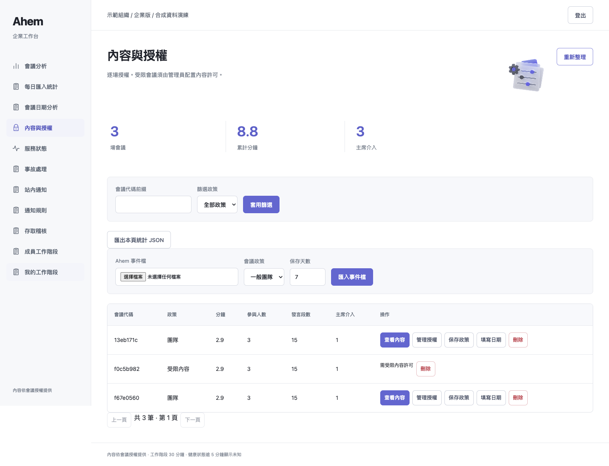
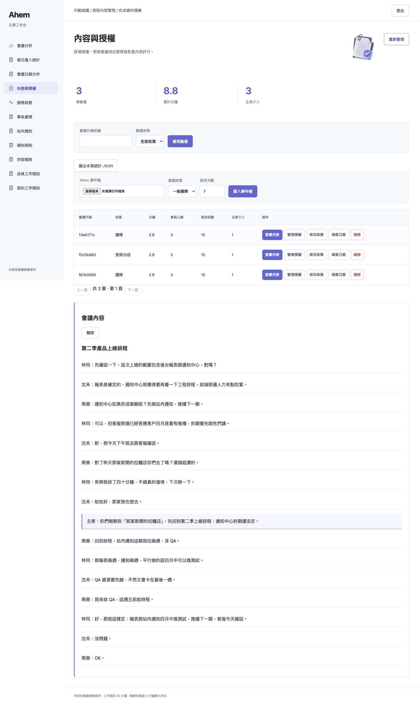
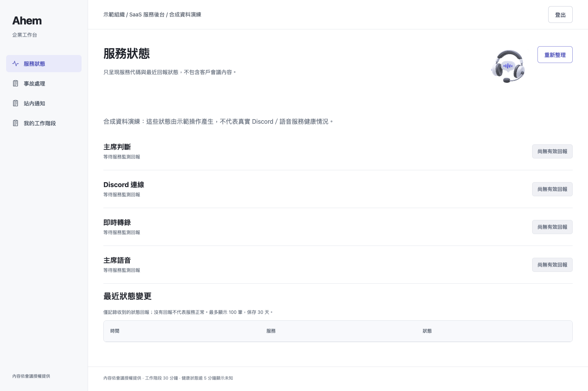

# 五天有效的本機 Demo 憑證

使用者要求：每組憑證自建立起 **5 × 24 小時**有效。
PR 公開程式與重建方式，不公開任何可登入的 token、KEK 或資料庫。

| 層級／用途 | Demo 身分 | 可展示內容 |
|---|---|---|
| 1 團隊參與者 | viewer | 獲授權的一般會議內容，不能管理授權 |
| 2 管理分析 | manager | 不含逐字稿的數字統計與篩選／匯出 |
| 3 後台管理 | operator | 一般內容、成員／授權／事故／通知管理；無受限內容許可 |
| 4 受限內容管理 | content-officer | operator 角色加明確內容許可，需確認讀取目的 |
| 4 外部觀察者 | observer | 非內容視角，不取得逐字稿 |
| 5 支援後台 | support | 固定服務狀態與事故，不提供會議內容 |

這些是用途分工，不是每個角色都繼承較低編號角色的權限。

## 重建（每次新目錄、新隨機秘密）

```sh
PYTHONPATH=src python scripts/enterprise_local_demo.py \
  --directory /absolute/new-private-demo --days 5 --port 8910
PYTHONPATH=src AHEM_KEK_FILE=/absolute/new-private-demo/kek python -m meeting_host.enterprise \
  --identities /absolute/new-private-demo/identities.json \
  --database /absolute/new-private-demo/enterprise.db --port 8910 --demo-mode
```

- `demo-login-cards.md`：0600 私有登入卡，含每個 token 與台灣時間到期日。
- `credential-manifest.json`：只有角色、期限與 URL，不含 token。
- 到期以 DB `member_credentials.expires` 判斷；重啟不會延長期限。API
  每次請求也驗證身分是否到期，不只是登入畫面顯示倒數。
- 目前持有的 session 最長 30 分鐘；即使 session 尚未到期，身分到期仍拒絕。
- 本工具預設 5 天；可指定 1–30 天。拒絕覆寫已有目錄。
- 只含合成資料，僅 loopback 存取；不能把這些帳號當成正式管理員或公開分享。
- 本輪新 demo 與舊 8891／8907 demo 分離，並未輪替或縮短舊憑證。

## 本輪證據

新憑證建立於 2026-09-05，台灣時間 **2026-09-10 14:31:16** 到期。
實際測試 URL：`http://127.0.0.1:8910/`。不提供遠端可用的公開 demo 網址。
`tests/test_demo_credentials_expiry.py` 用固定時鐘驗證六角色恰好 432000 秒有效，
並在關閉／重開 Workspace 後確認到期 token 全被拒絕；不是實際等候五天的耐久測試。
指定到期／憑證測試：11 passed，exit 0。

本輪完整測試 **655 passed、21 skipped、2 xfailed、0 failed，36.96 秒，exit 0**，
指令 `PYTHONPATH=src:../outputs/enterprise-ui-20260905 ../ahem/.venv/bin/python -m pytest -p browser_channel -q -rs tests`。
[完整 log](evidence/five-day-demo/pytest.log)。21 skips 仍是 17 私有 holdout 與 4 Discord opt-in。
首次完整執行有 1 項 `Page.goto` 30 秒逾時；六角色截圖程序結束後單獨完整重跑通過，
沒有跳過該測試，也不把逾時認定為已證明根因的產品錯誤。

六角色實際 Chrome 登入／操作：全部 pass、page_errors=0、console_errors=0，exit 0。
詳見 [角色驗證 JSON 與截圖](evidence/five-day-demo/browser-results.json)。
環境為 macOS arm64、Python 3.13.5、Playwright＋Chrome；Browser plugin unavailable。
檢查含標題、非空白頁、操作回應、角色隔離、桌機與 390px 手機無橫向溢出。




