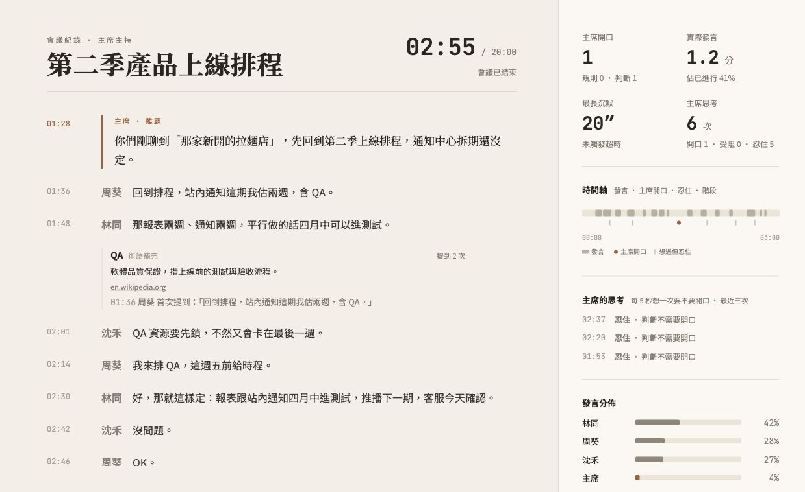

# Ahem 團隊版 Demo 範圍

## 唯一目標

與會者看完整逐字稿，並清楚看到 AI 主席在真實對話中何時開口、為什麼開口，
以及何時選擇忍住。

```text
Discord 真人對話
  -> ElevenLabs Scribe 即時轉錄
  -> Ahem 主席判斷離題、超時與收斂時機
  -> Azure 或 ElevenLabs 台灣華語主席聲音
  -> 團隊版畫面顯示完整逐字稿、主席介入與會議結果
```

## Demo 內功能

- 完整逐字稿與發言者姓名
- 主席介入內容及判斷理由
- 離題、超時與收斂提示
- 主席開口／忍住時間軸
- 術語補充與發言分布
- Azure 台灣華語男聲／女聲選擇
- 會議結束及紀錄輸出
- 雲端服務異常時的合成事件回放

## 明確不做

本次 demo 不實作或展示管理版、企業版、受監管產業版與 SaaS 後台，包含：

- 逐字稿遮蔽與「已隱去」佔位文字
- 匿名化 P01／P02
- Viewer／Operator 企業權限治理
- KEK、加密保存、retention 與解密稽核
- 外部觀察者與客服健康狀態後台

相關研究保留在既有 security PR，不併入本 demo 分支。

## 啟動

真實會議仍依 `docs/demo-runbook.md` 操作。無 Discord 時使用公開合成資料回放：

```bash
PYTHONPATH=src .venv/bin/python -u -m meeting_host.spectator \
  --replay examples/synthetic-meeting.events.jsonl --port 8765 --speed 20
```

## 驗收

```bash
AHEM_PYTHON=.venv/bin/python scripts/demo-team-check.sh
```

通過條件：focused tests、完整公開測試套件與「畫面不存在遮蔽佔位文字」檢查皆為
exit 0。Raspberry Pi 5、真實 Discord、Azure／ElevenLabs 與公開 HTTPS 必須另外做
實機 smoke test，不能用離線測試或回放截圖代替。

## 實際回放畫面

以下畫面由本分支的真實 `meeting_host.spectator` 服務讀取
`examples/synthetic-meeting.events.jsonl` 後產生，不是靜態 mock：



- 尺寸：1239 x 759
- SHA-256：`59dbb2bbf8af2148ff4d9eb247f5606899b9d415adb33d34d25aeae8f33af7d0`
- 頁面：`Ahem 觀戰畫面`
- Browser console：0 errors、0 warnings
- 畫面包含：完整合成逐字稿、發言者、主席離題介入、術語卡、主席思考、時間軸與發言分布
- 畫面不包含：「已隱去」或 P01／P02 匿名化佔位文字
