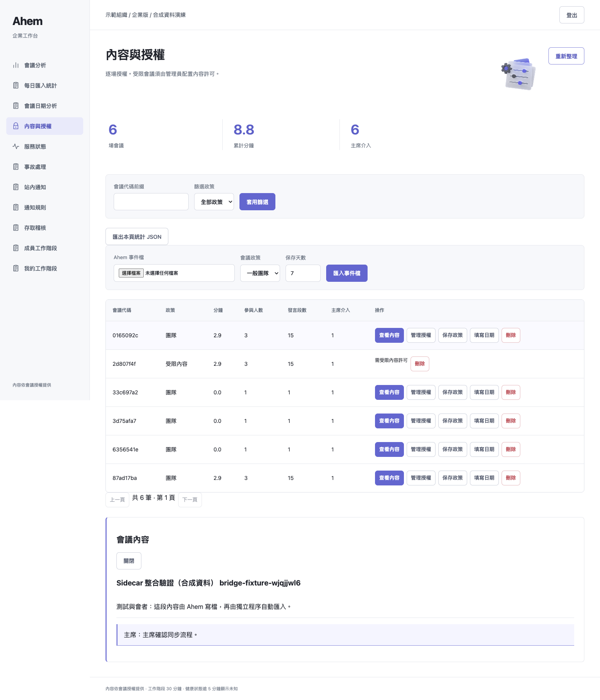
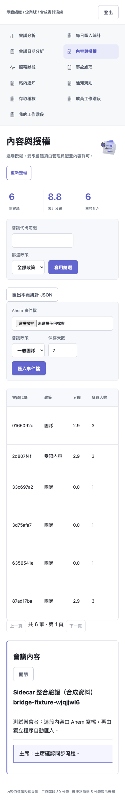

# 上游＋獨立後台整合驗證（2026-09-05）

## 結論

本次從上游 `f025fef` 建立 `codex/enterprise-sidecar`，不是把企業分支整包合入。
本機合成資料整合可展示，適合 Draft PR 討論；不代表 Raspberry Pi、真實語音、
高負載或正式合規系統已驗收，也不要求 demo 前合併。

## 本次實測

環境：macOS 26.6.2 arm64、Python 3.13.5、既有開發 venv、Playwright＋Chrome。
Browser plugin not available，依前端測試技能使用既有 Playwright 腳本。
使用隔離服務 `http://127.0.0.1:8907/`；原 8891 demo 未修改。

| 驗證 | 結果／證據 |
|---|---|
| 完整 suite | **654 passed、21 skipped、2 xfailed、0 failed，61.02 秒，exit 0**；[pytest.log](pytest.log) |
| 六角色 UI | 六者 pass、page_errors=0、console_errors=0；[browser-results.json](browser-results.json)，exit 0 |
| 真正整合入口 | Ahem `_write_events_jsonl` → 第一個 bridge CLI 入庫 1 筆 → 第二個 CLI 重試只辨識 1 筆重複 → 已運行 UI 讀到同一筆內容；[bridge-results.json](bridge-results.json)，exit 0 |
| 寫檔中斷 | 模擬 replace 失敗，舊檔保留、不發布半檔、temporary 清除；`tests/test_enterprise_bridge.py` |
| 去重／隔離 | 重開 DB 後重試、刪除後不復活、跨 tenant、transaction rollback、symlink 拒絕、停用角色拒絕；同上 |
| 核心無硬相依 | 阻擋 cryptography import 的全新程序仍可 import live，且未載入 enterprise；`tests/test_sidecar_core_isolation.py` |
| 核心保留 | 下列 git diff 指令 exit 0，無輸出；主線 token／原 viewer UI／聲音設定不變 |

21 skipped：17 個私有 holdout 缺失、4 個真實 Discord opt-in；不是本次刻意省略。
2 xfailed 為上游既有預期失敗。安裝 enterprise 依賴後本次沒有 enterprise skip。
第一次 fork Linux CI 為 651 passed（[run](https://github.com/billiswen-png/ahem/actions/runs/33949479297)），
但上游 PR 的兩個 jobs 後續暴露出相同的時鐘浮點斷言問題：
`59.99999999999997 != 60.0`、`5.000000000000028 != 5.0`
（[失敗 run](https://github.com/Chuanyin1202/ahem/actions/runs/33949543784)）。
因此僅修改 `tests/test_state_silence.py` 的三個時間斷言：固定兩個時鐘基準、
`pytest.approx(rel=0, abs=1e-8)`；額外三個案例令 passed 由 651 變為 654。
10 ns tolerance 不會掩蓋原本「加入後 5 秒被算成 65 秒」的缺陷，`state.py` 完全不改，
也沒有加回上游已撤回的 rounding。最新上游 CI 請讀取 PR checks，不沿用第一次 success。
僅安裝核心套件的環境會明確 skip enterprise 模組測試；新增專用 CI 強制安裝
enterprise 與瀏覽器依賴，不能把核心-only skip 當作後台測試通過。

首次完整測試為 640 passed／10 failed：10 個均因預設 Chromium executable 缺少，
改用既有 Chrome adapter 後完整重跑；adapter 只選瀏覽器，不繞過安全邏輯。
第一版 bridge UI 驗證腳本未切換到「內容與授權」分頁而逾時，修正導航後重跑通過。
沒有把這些失敗當作成功，也沒有停用對應測試。

## 重現指令

```sh
PYTHONPATH=src:../outputs/enterprise-ui-20260905 ../ahem/.venv/bin/python \
  -m pytest -p browser_channel -q -rs tests
# 標準 CI／已有 Chromium 的環境：
PYTHONPATH=src python -m pytest -q -rs tests

python scripts/verify_enterprise_browser.py --identities PRIVATE_IDENTITIES \
  --url http://127.0.0.1:8907 --output SCREENSHOT_DIRECTORY --channel chrome
PYTHONPATH=src python scripts/verify_sidecar_e2e.py --runtime PRIVATE_SYNTHETIC_RUNTIME \
  --url http://127.0.0.1:8907 --output SCREENSHOT_DIRECTORY

git diff --exit-code origin/main -- src/meeting_host/spectator.py \
  src/meeting_host/state.py src/meeting_host/speaker.py \
  src/meeting_host/discord_source.py requirements.txt
git diff --check
```

瀏覽器腳本會操作合成資料、授權、匯入；只對專用 demo 使用。
`verify_sidecar_e2e.py` 每次建立新的合成來源，不測真實 Discord 網路／Azure／ElevenLabs。
兩個 fresh CLI 是可重現的同步／重啟測試，非多天排程、斷電或容量證明。

## 部署／未驗證

完整架構、部署、回復與資料限制：[enterprise-sidecar.md](../../enterprise-sidecar.md)。
新增 Linux CI 定義不等於 CI 已通過，請以 GitHub 該次 run 為準。
未實測：乾淨 Raspberry Pi 安裝、systemd template、真實會議 end-to-end、磁碟滿／斷電
整機恢復、長時間與大型事件檔。現行匯入仍受 4 MiB／10,000 events 限制。
來源 plaintext 與 receipts 保留需另外管理；沒有 SSO 或即時 service health adapter。
原上游會議視圖不遮蔽、不更換連結；後台權限是獨立界線。

## 實際畫面（合成會議，不是設計稿）



