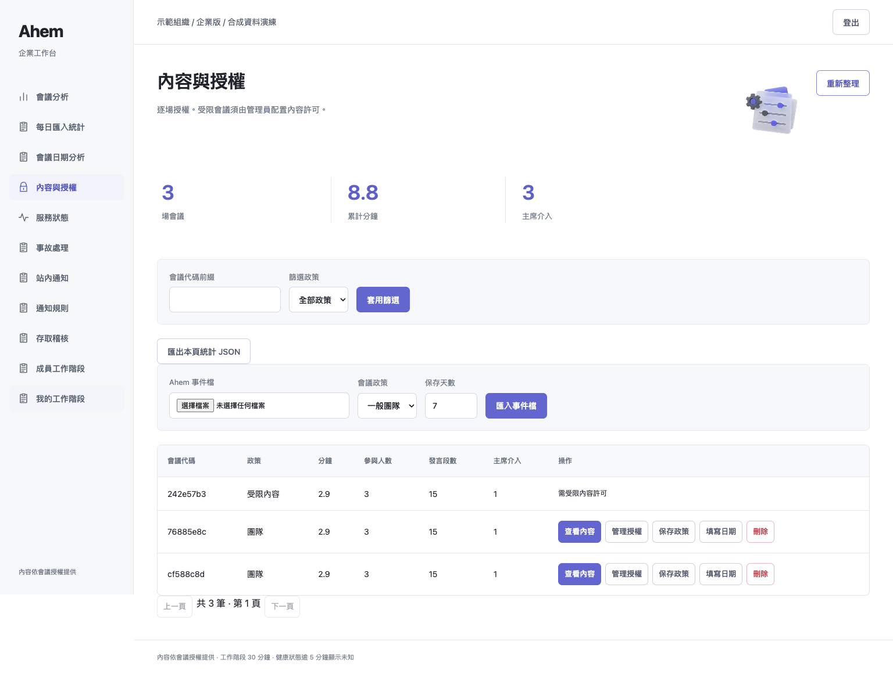
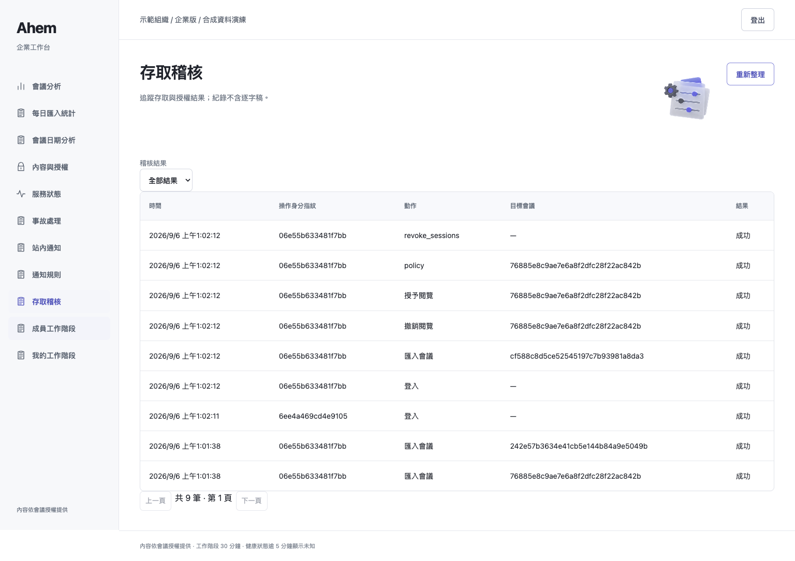
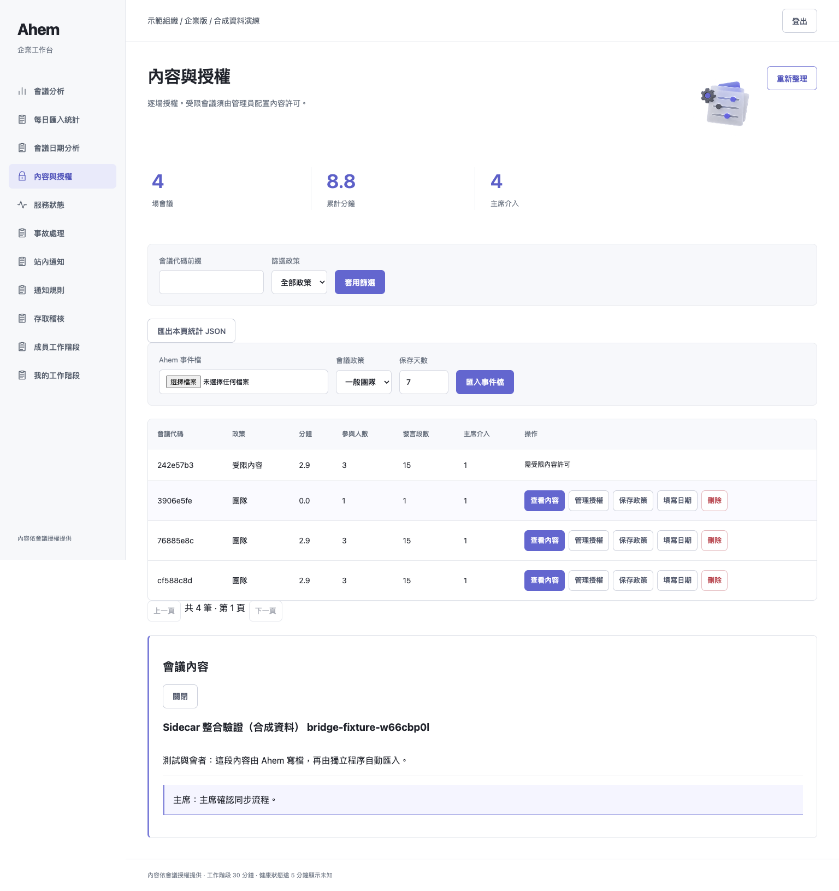
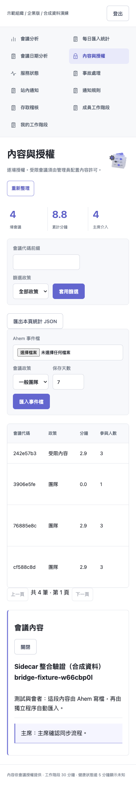

# Main integration and eight review fixes

Validated code: `548b98b039d714b7e94dd38ab7f50f2132608a6e`, including upstream
`ec831d3f29c974b65fa36b036d3d58eea3798737`. This evidence-only follow-up adds no runtime changes.

## Environment and commands

macOS arm64, Python 3.13.5, existing venv, Playwright with installed Chrome.

```sh
PYTHONDONTWRITEBYTECODE=1 PYTHONPATH=src:scripts ../ahem/.venv/bin/python \
  -m pytest -p no:cacheprovider -p browser_test_profile -q -rs tests
git diff --check
```

**717 passed, 21 skipped, 2 xfailed, 0 failed; 44.70 seconds, exit 0**.
[Full log](full-tests-final.log). Skips remain 17 private holdout and 4 real
Discord opt-in conditions. Test profile only replaces external Google Fonts CSS;
it does not intercept application/auth APIs. External font availability is not tested.
New Linux CI must be evaluated separately; old successful runs are not evidence for this head.

## Changes and evidence

See [eight policies and migration](../../sidecar-review-policies.md) and
`tests/test_review_regressions.py` (10 tests). Changes cover lock recovery,
restricted deletion, target-aware audit, failed-login vs total throttling,
Taipei meeting dates, bounded nonblocking KEK reads, atomic no-clobber backups,
and effective session expiry. The additional current-main event regression in
`tests/test_enterprise_bridge.py` preserves minutes/ai_critique events encrypted,
without leaking their text into management aggregates.

Against the stated upstream revision, requirements.txt, .env.example, spectator,
speaker, state and style are byte-identical. The only existing runtime difference
is live.py's atomic final JSONL writer. Core import without cryptography passes.

## Local synthetic demo

```sh
python scripts/verify_enterprise_browser.py --identities PRIVATE_RUNTIME/identities.json \
  --output EVIDENCE_DIR --url http://127.0.0.1:8913 --channel chrome
PYTHONPATH=src python scripts/verify_sidecar_e2e.py --runtime PRIVATE_RUNTIME \
  --url http://127.0.0.1:8913/ --output EVIDENCE_DIR
```

Both exit 0. All six roles pass with zero page/unexpected console errors; initial
unauthenticated /api/me 401 is expected. Desktop 1536x1024, mobile 390x844.
Verified login/logout, role navigation, imports/grants/content, retention and
statistics. Real live writer with synthetic events -> fresh bridge processes ->
running UI: first imported=1, second duplicates=1, rejected=0.

[Role results](browser-results.json), [bridge results](bridge-results.json).






## Remaining risks and deployment

No Raspberry Pi/systemd, clean Linux deployment, paid speech API, long-duration
load or actual power-loss validation. Backup failures were simulated. Source
JSONL remains plaintext with separate retention. Workbench is single-web-process
plus independent bridge; not external SSO, real health monitoring or certification.

Stop services and back up DB/KEK/settings before upgrading. Startup adds nullable
audit.target; old rows keep null. Old positional audit writers cannot use the
migrated schema. Rollback requires a pre-upgrade DB and credential/permission review.
Keep private credentials/KEK/DB out of GitHub. This is a review proposal, not an
instruction to merge before demo or a claim of production readiness.
