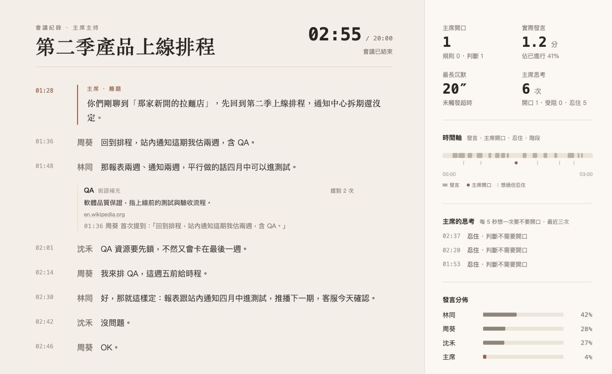
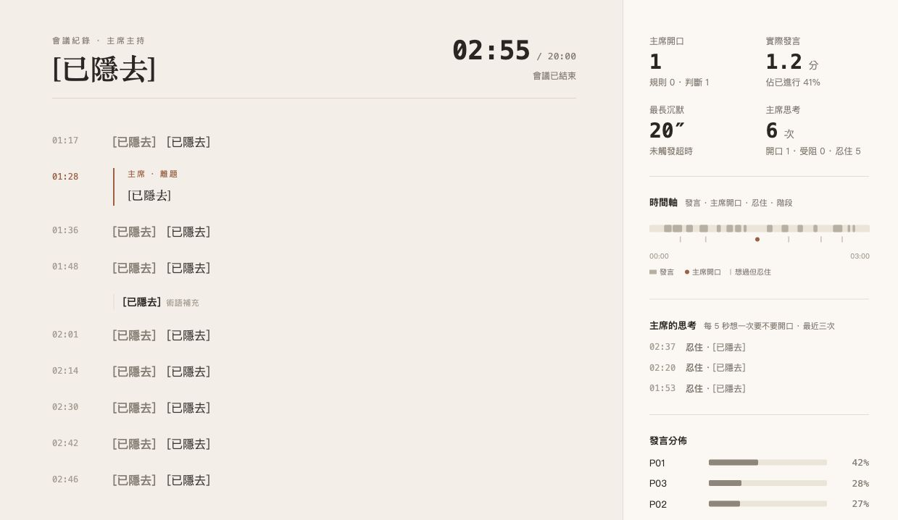

# Runtime screenshot evidence

這兩張畫面由實際啟動的 `meeting_host.spectator` 回放服務產生，資料來源是公開 repo
內的 `examples/synthetic-meeting.events.jsonl`，不含真實會議內容或正式憑證。

## Demo participant viewer

啟動條件為 `AHEM_VIEWER_CONTENT=full` 與
`AHEM_DEMO_PUBLIC_TRANSCRIPT=1`。畫面顯示合成逐字稿、主席介入、術語卡、
主席思考、時間軸與發言分布。



- 尺寸：1239 x 759
- SHA-256：`645ae8d8538c5785e63ba92231baf5ca01ee71acfc3070aba6b15ecebb139d2d`
- Browser console：0 errors，0 warnings
- 互動驗證：點擊 QA 術語卡來源後，成功開啟
  `https://en.wikipedia.org/wiki/Software_quality_assurance`。

## Private observer viewer

啟動條件為 `AHEM_VIEWER_CONTENT=redacted`。相同合成事件保留計量與時間軸，
但會議主題、姓名、逐字稿、主席話術與術語內容皆被遮蔽。



- 尺寸：1239 x 718
- SHA-256：`40f33e10138a87f89f7b178d469eca7011292c88c958b19920e49b4fa8de5442`
- Browser console：0 errors，0 warnings

## Reproduction

使用兩組不同且至少 32 字元的本機測試 token 啟動，切勿把正式 token 寫入文件：

```bash
AHEM_VIEWER_TOKEN=<local-demo-viewer-token> \
AHEM_OPERATOR_TOKEN=<local-demo-operator-token> \
AHEM_VIEWER_CONTENT=full \
AHEM_DEMO_PUBLIC_TRANSCRIPT=1 \
PYTHONPATH=src .venv/bin/python -u -m meeting_host.spectator \
  --replay examples/synthetic-meeting.events.jsonl --port 8876 --speed 20
```

瀏覽器使用 `http://127.0.0.1:8876/#token=<local-demo-viewer-token>` 進行一次性
交換；成功後 fragment 必須清除，後續以短效 HttpOnly cookie 驗證。

## Scope

這是本機 Chrome 的桌面尺寸驗證。Raspberry Pi 5、正式 Discord、公開 HTTPS、
行動裝置與真實語音服務仍需另行驗收，不能由此截圖推定通過。
